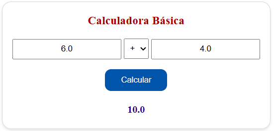
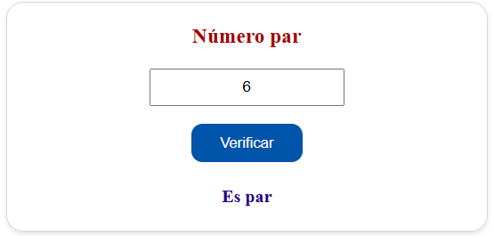
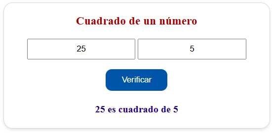
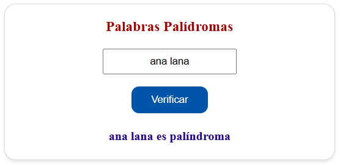

<p align="center">
  <a href="https://webhistorico.epn.edu.ec/" target="_blank"></a>
  <a href="https://fis.epn.edu.ec/index.php/es/" target="_blank"></a>
</p>

<p align="center">Un marco moderno, rápido y eficiente para construir aplicaciones empresariales utilizando <a href="https://www.java.com/" target="_blank">Java</a> con <a href="https://spring.io/projects/spring-boot" target="_blank">Spring Boot</a>.</p>

<p align="center">
  <a href="https://webhistorico.epn.edu.ec/" target="_blank">Epn</a> | 
  <a href="https://fis.epn.edu.ec/index.php/es/" target="_blank">Fis Epn</a> | 
  <a href="https://fis.epn.edu.ec/index.php/es/oferta-academicafis/software" target="_blank">Metodologías Ágiles</a> | 
</p>

# 🧮 Aplicación Demo con Spring Boot

Este proyecto implementa una serie de funcionalidades básicas en una aplicación Spring Boot con pruebas unitarias, controlador, servicios y despliegue con Docker.

---

## ✨ Funcionalidades

### 2.1 🔢 Calculadora básica con dos números

Realiza operaciones matemáticas básicas: suma, resta, multiplicación y división. Se valida que los parámetros ingresados sean correctos y se controla la división por cero devolviendo `NaN`.

#### 📦 Modelo

- Toma 3 parámetros: `a`, `b` y `op` (`+`, `-`, `*`, `/`)
- Usa expresiones regulares para validar la operación.

```bash
@Data
public class Calculator {
    @NotNull
    public Double a;

    @NotNull
    private Double b;

    @NotNull
    @Pattern(regexp = "[+\\-*/]", message = "Operación no válida")
    private String op;
}
```

#### ⚙️ Servicio

- Ejecuta la operación matemática.
- Maneja división sobre cero.

```bash
public double calculate(double a, double b, String op){
        return switch (op){
            case "+" -> a + b;
            case "-" -> a - b;
            case "*" -> a * b;
            case "/" -> b != 0 ? a / b: Double.NaN;
            default -> throw new IllegalArgumentException("Operación no válida");
        };
    }
```

#### 🧭 Controlador

- Recibe los datos de la vista.
- Llama al servicio y retorna el resultado.

```bash
@PostMapping("/calculate")
public String calculate(
    @ModelAttribute("calculatorForm") @Valid Calculator form,
    BindingResult result,
    Model model) {

    loadForms(model);
    if (result.hasErrors()) {
        model.addAttribute("result", "Error de validación");
    } else {
        double value = practiceOneService.calculate(form.getA(), form.getB(), form.getOp());
        model.addAttribute("result", value);
    }
    return "practiceone";
}
```

#### ✅ Pruebas

- **Servicio:** Verifica todos los operadores, incluyendo división por cero.

```bash
@Test
void testAddition() {
    assertEquals(15, practiceOneService.calculate(9, 6, "+"));
}
@Test
void testSubstraction() {
    assertEquals(-5, practiceOneService.calculate(10,15, "-"));
}
@Test
void testMultiplication() {
    assertEquals(24, practiceOneService.calculate(3, 8, "*"));
}
@Test
void testDivisionByZero() {
    assertEquals(Double.NaN, practiceOneService.calculate(8, 0, "/"));
}
@Test
void testDivision() {
    assertEquals(2.5, practiceOneService.calculate(10, 4, "/"));
}
```

- **Controlador:** Asegura el flujo correcto entre vista y servicio.

```bash
@Test
void testCalculator() throws Exception {
    when(practiceOneService.calculate(10, 0, "/")).thenReturn(Double.NaN);
    mockMvc.perform(post("/calculate")
            .param("a", "10")
            .param("b", "0")
            .param("op", "/"))
            .andExpect(status().isOk())
            .andExpect(model().attribute("result", Double.NaN))
            .andExpect(view().name("practiceone"));
}
```

---

### 2.2 🧮 Verificar si un número es par

Verifica si un número ingresado es par o impar, devolviendo una cadena “Es par” o “No es par”.

#### 📦 Modelo

- Recibe un solo parámetro obligatorio `number`.

```bash
@Data
public class Pair {

    @NotNull(message = "Ingrese un número")
    private Integer number;
}
```

#### ⚙️ Servicio

- Devuelve una cadena según la paridad del número `Es par` o `No es par`.

```bash
public String isPair(int a) {
    return a % 2 == 0 ? "Es par" : "No es par";
}
```

#### 🧭 Controlador

- Toma el número de la vista, envía al servicio y retorna resultado.

```bash
@PostMapping("/pair")
public String isPair(
    @ModelAttribute("pairForm") @Valid Pair form,
    BindingResult result,
    Model model) {

    loadForms(model);
    if (result.hasErrors()) {
        model.addAttribute("pairResult", "Número inválido");
    } else {
        String value = practiceOneService.isPair(form.getNumber());
        model.addAttribute("pairResult", value);
    }
    return "practiceone";
}
```

#### ✅ Pruebas

- **Servicio:** Verificación de paridad.

```bash
@Test
void testPair(){
    assertEquals("Es par", practiceOneService.isPair(128));
}
@Test
void testUnpair(){
    assertEquals("No es par", practiceOneService.isPair(333));
}
```

- **Controlador:** Flujo correcto desde vista al servicio.

```bash
@Test
void testPair() throws Exception {
    when(practiceOneService.isPair(76)).thenReturn("Es par");
    mockMvc.perform(post("/pair")
            .param("number", "76"))
            .andExpect(status().isOk())
            .andExpect(model().attribute("pairResult", "Es par"))
            .andExpect(view().name("practiceone"));
}
```

---

### 2.3 🧠 Determinar si un número es el cuadrado del otro

Verifica si uno de los dos números es el cuadrado exacto del otro.

#### 📦 Modelo

- Recibe dos parámetros obligatorios `firstNumber` y `SecondNumber`.

```bash
@Data
public class SquareNumber {

    @NotNull(message = "Ingrese el primer número")
    private Integer firstNumber;

    @NotNull(message = "Ingrese el segundo número")
    private Integer secondNumber;
}
```

#### ⚙️ Servicio

- Determina cuál es mayor y verifica si uno es el cuadrado del otro.

```bash
public String squareNumber (int a, int b) {
    if (a > b) {
        return b * b == a ? a + " es cuadrado de " + b : a + " no es cuadrado de " + b;
    } else {
        return a * a == b ? b + " es cuadrado de " + a : b + " no es cuadrado de " + a;
    }
}
```

#### 🧭 Controlador

- Administra el flujo de datos vista-servicio.

```bash
@PostMapping("/square")
public String isSquare(
    @ModelAttribute("squareForm") @Valid SquareNumber form,
    BindingResult result,
    Model model) {

    loadForms(model);
    if (result.hasErrors()) {
        model.addAttribute("squareResult", "Números inválidos");
    } else {
        String value = practiceOneService.squareNumber(form.getFirstNumber(), form.getSecondNumber());
        model.addAttribute("squareResult", value);
    }
    return "practiceone";
}
```

#### ✅ Pruebas

- **Servicio:** Prueba casos válidos e inválidos.

```bash
@Test
void testFirstSquare() {
    assertEquals("81 es cuadrado de 9", practiceOneService.squareNumber(9, 81));
}
@Test
void testSecondSquare() {
    assertEquals("25 es cuadrado de 5", practiceOneService.squareNumber(25, 5));
}
@Test
void testSquare() {
    assertEquals("8 no es cuadrado de 2", practiceOneService.squareNumber(8, 2));
}
```

- **Controlador:** Verificación completa del flujo y la lógica.

```bash
@Test
void testSquare() throws Exception {
    when(practiceOneService.squareNumber(6, 36)).thenReturn("36 es cuadrado de 6");
    mockMvc.perform(post("/square")
            .param("firstNumber", "6")
            .param("secondNumber", "36"))
            .andExpect(status().isOk())
            .andExpect(model().attribute("squareResult", "36 es cuadrado de 6"))
            .andExpect(view().name("practiceone"));
}
```

---

### 2.4 🔁 Verificar si una palabra es palíndroma

Comprueba si una palabra o frase se lee igual al derecho que al revés.

#### 📦 Modelo

- Un parámetro obligatorio `word` (palabra o frase).

```bash
@Data
public class Palindrome {

    @NotBlank(message = "Ingrese una palabra")
    private String word;
}
```

#### ⚙️ Servicio

- Limpia el texto: elimina espacios, símbolos y lo convierte a minúsculas.
- Compara la palabra original con su reverso.

```bash
public String isPalindrome(String a) {
    String clean = a.replaceAll("[\\W_]", "").toLowerCase();
    String reversed = new StringBuilder(clean).reverse().toString();
    return reversed.equals(clean) ? a + " es palíndroma" : a + " no es palíndroma";
}
```

#### 🧭 Controlador

- Conecta la vista con el servicio y entrega el resultado.

```bash
@PostMapping("/palindrome")
public String isPalindrome(
    @ModelAttribute("palindromeForm") @Valid Palindrome form,
    BindingResult result,
    Model model) {

    loadForms(model);
    if (result.hasErrors()) {
        model.addAttribute("palindromeResult", "Texto inválido");
    } else {
        String value = practiceOneService.isPalindrome(form.getWord());
        model.addAttribute("palindromeResult", value);
    }
    return "practiceone";
}
```

#### ✅ Pruebas

- **Servicio:** Verifica casos palíndromos y no palíndromos.

```bash
@Test
void testPalindrome() {
    assertEquals("oso es palíndroma", practiceOneService.isPalindrome("oso"));
}
@Test
void testNotPalindrome() {
    assertEquals("Juan no es palíndroma", practiceOneService.isPalindrome("Juan"));
}
```

- **Controlador:** Controla el flujo correcto para mostrar el resultado.

```bash
@Test
void testPalindrome() throws Exception {
    when(practiceOneService.isPalindrome("ana")).thenReturn("ana es palíndroma");
    mockMvc.perform(post("/palindrome")
            .param("word", "ana"))
            .andExpect(status().isOk())
            .andExpect(model().attribute("palindromeResult", "ana es palíndroma"))
            .andExpect(view().name("practiceone"));
}
```

---

## 💻 Demostración de la funcionalidad

| Funcionalidad            | Imagen                                                    |
| ------------------------ | --------------------------------------------------------- |
| 🔢 Calculadora básica    |  |
| 🧮 Número Par            |  |
| 🧠 Cuadrado de un número |  |
| 🔁 Palabras palíndromas  |  |

---

## 🐳 Despliegue con Docker y Docker Hub

Pasos para dockerizar la aplicación:

### 1️⃣ Compilar el proyecto

```bash
mvn clean package
```

### 2️⃣ Archivo Dockerfile

```bash
FROM openjdk:21-jdk-slim
WORKDIR /app
COPY target/demo-0.0.1-SNAPSHOT.jar app.jar
EXPOSE 8080
ENTRYPOINT ["java","-Djava.security.egd=file:/dev/urandom","-jar","app.jar"]
```

- Indica que la imagen base será openjdk:21-jdk-slim, una versión ligera de Java 21 JDK. Debido a que Slim tiene un tamaño reducido, ideal para producción, ya que incluye solo lo esencial para ejecutar aplicaciones Java.

- Establece /app como el directorio de trabajo dentro del contenedor. Todas las instrucciones posteriores (COPY, RUN, etc.) se ejecutarán desde aquí, y tu aplicación se ubicará en esta carpeta.

- Copia el archivo JAR generado por Maven desde la máquina local (target/demo-0.0.1-SNAPSHOT.jar) al contenedor. Lo copia con el nombre app.jar dentro del contenedor.

- Exponer el puerto 8080: Esto indica que la aplicación dentro del contenedor escucha en el puerto 8080. No abre el puerto por sí solo, pero es útil para documentación y herramientas como Docker Compose o Kubernetes.

- Define el comando que se ejecutará al iniciar el contenedor.
  - java ejecuta la aplicación.
  - -Djava.security.egd=file:/dev/urandom mejora la velocidad de generación de números aleatorios (especialmente en contenedores).
  - -jar app.jar indica que se ejecutará el archivo app.jar como una aplicación Java.

### 3️⃣ Generar el contenedor

- Construir el contenedor

```bash
docker build -t <nombre-usuario>/springboot-demoapp .
```

- Ejecutar el contenedor

```bash
docker run -p 8080:8080 <nombre-usuario>/springboot-demoapp
```

- Visualizar en el navegador en `http:://localhost:8080/practice-01` para asegurar el correcto funcionamiento del contenedor.

### 4️⃣ Subir contenedor a Docker Hub

- Iniciar sesión con docker

```bash
docker login
```

- Hacer push del contenedor generado anteriormente

```bash
docker push <nombre-usuario>/springboot-demoapp
```
